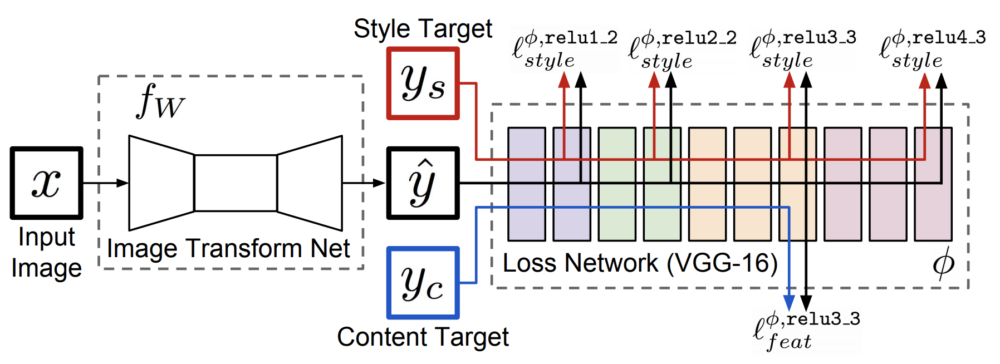

## dl-projects
Projects Using Various Deep Learning Methods

- [Super Resolution Using GANs](https://github.com/danieldiamond/dl-projects/tree/master/super-resolution)
  

     >>>>>>> 
    

- [Colorizing B&W Images Using U-Net & Feature Loss Applications](https://github.com/danieldiamond/dl-projects/tree/master/colorize)
  

     >>>>>>> 
    

- Feature Loss inspired by [Perceptual Losses for Real-Time Style Transfer and Super-Resolution](https://arxiv.org/pdf/1603.08155.pdf). The idea here is that instead of using MSELoss on pixel values and a CrossEntropy loss for the Critic model, can we go deeper and compare the features displayed in the real image and the generated image. Let's discuss further:  

_Johnson, et al. “Perceptual Losses for Real-Time Style Transfer and Super-Resolution.” Computer Vision – ECCV 2016 Lecture Notes in Computer Science, 2016, pp. 694–711._
